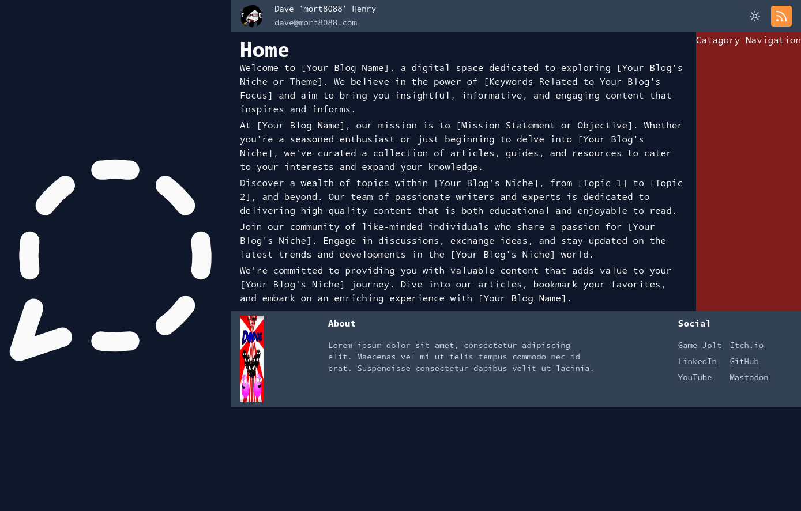

# mort8088.com dotnet/React-TS

To-Do:-
[X] Light/Dark mode switch
[X] RSS Feed
[ ] Light Colour Theme
[ ] Dark Colour Theme
[ ] Static pages
[ ] Basic Site Navigation
[ ] SQLite3 Data layer
[ ] Posts table
[ ] Feeds component
[ ] Post component
